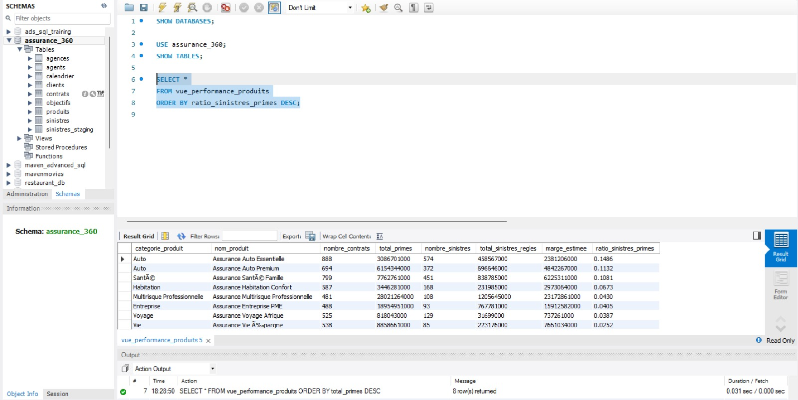
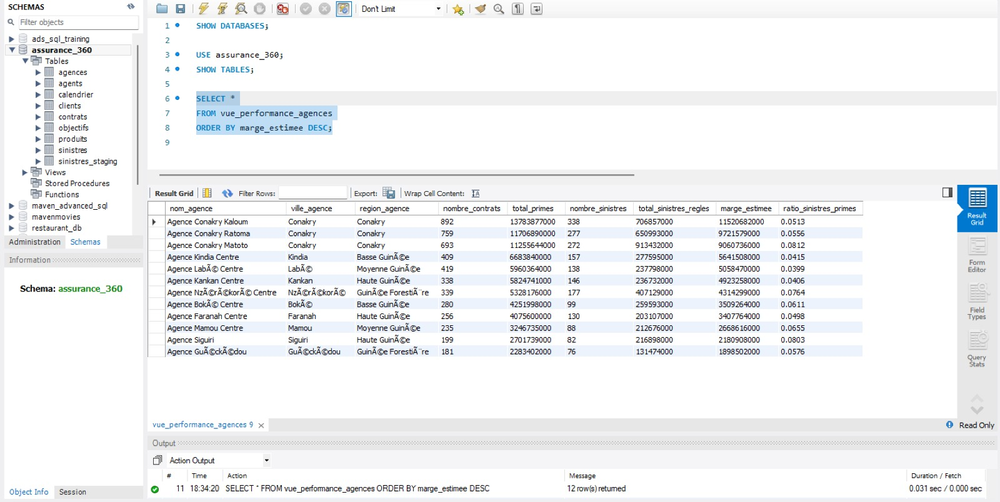

# Analyse SQL 360 — Assurance

## Contexte du projet

Ce projet est un cas fictif d’analyse SQL appliqué au secteur de l’assurance en Guinée.

L’objectif est d’utiliser MySQL Workbench pour créer une base de données relationnelle, importer des fichiers CSV, contrôler la qualité des données, calculer des KPIs et produire des analyses business exploitables.

Ce projet complète mes travaux précédents réalisés avec Power BI et Excel sur le même univers métier assurance.

---

## Objectif business

L’objectif est de répondre à plusieurs questions clés :

- Quels produits génèrent le plus de primes ?
- Quels produits présentent le plus fort ratio sinistres/primes ?
- Quelles agences contribuent le plus à la marge estimée ?
- Quels segments clients renouvellent le mieux ?
- Les objectifs de primes sont-ils atteints ?
- Les données sont-elles fiables avant analyse ?

---

## Outil principal

- MySQL Workbench

---

## Compétences SQL mobilisées

- Création de base de données
- Création de tables
- Import de fichiers CSV
- Contrôles qualité
- Jointures SQL
- Agrégations
- GROUP BY
- CASE WHEN
- HAVING
- CTE
- Vues SQL
- Analyse business

---

## Structure du projet

- `donnees/`
  - `Agences.csv`
  - `Agents.csv`
  - `Calendrier.csv`
  - `Clients.csv`
  - `Contrats.csv`
  - `Objectifs.csv`
  - `Produits.csv`
  - `Sinistres.csv`

- `sql/`
  - `01_creation_base.sql`
  - `02_creation_tables.sql`
  - `03_import_donnees.md`
  - `03_import_sinistres_staging_fix.sql`
  - `04_controles_qualite.sql`
  - `05_kpis_globaux.sql`
  - `06_analyses_business.sql`
  - `07_vues_sql.sql`

- `captures_ecran/`
  - `01_volumes_importes.png`
  - `02_kpis_globaux.png`
  - `03_performance_produits.png`
  - `04_risque_produits.png`
  - `05_performance_agences.png`

- `documentation/`
  - `insights_business.md`

- `README.md`

---

## Modèle de données

Le projet repose sur 8 tables principales.

### Tables de dimensions

- Agences
- Agents
- Calendrier
- Clients
- Produits

### Tables de faits

- Contrats
- Sinistres
- Objectifs

Les analyses sont construites autour des contrats, des primes, des sinistres, des objectifs, des produits, des agences et des clients.

---

## Import des données

Les fichiers CSV ont été importés dans MySQL Workbench avec l’outil :

`Table Data Import Wizard`

Les données ont été importées dans des tables existantes.

Un cas particulier a été traité pour la table `Sinistres`. Certaines valeurs du fichier CSV étaient au format texte ou décimal, notamment sur les dates et les délais de règlement. Une table intermédiaire `sinistres_staging` a donc été utilisée pour importer les données en texte, puis les convertir proprement avant insertion dans la table finale `sinistres`.

Cette correction est documentée dans :

`sql/03_import_sinistres_staging_fix.sql`

---

## Contrôles qualité réalisés

Avant l’analyse, plusieurs contrôles ont été effectués :

- vérification du nombre de lignes importées ;
- recherche de doublons sur les clés primaires ;
- vérification des contrats sans client, produit, agent ou agence ;
- vérification des sinistres sans contrat ;
- vérification des objectifs sans agence ou produit ;
- contrôle des montants négatifs ;
- contrôle des dates incohérentes.

Les contrôles n’ont pas révélé d’anomalie bloquante.

---

## KPIs calculés en SQL

Les requêtes SQL permettent de calculer :

- nombre de contrats ;
- nombre de clients ;
- nombre de sinistres ;
- total des primes ;
- total des commissions ;
- total des sinistres réglés ;
- marge estimée ;
- ratio sinistres/primes ;
- taux de renouvellement ;
- taux d’atteinte des objectifs.

---

## Aperçu des résultats SQL

### 1. Volumes importés

### 2. KPIs globaux

### 3. Performance produits

### 4. Risque produits

### 5. Performance agences

---

## Analyses business réalisées

Les requêtes SQL permettent d’analyser :

- la performance par produit ;
- la performance par agence ;
- la performance par segment client ;
- les sinistres par type ;
- les objectifs réalisés vs objectifs ajustés.

---

## Vues SQL créées

Le projet inclut plusieurs vues réutilisables :

- `vue_kpis_globaux`
- `vue_performance_produits`
- `vue_performance_agences`
- `vue_performance_segments`
- `vue_objectifs_annuels`

Ces vues permettent de réutiliser facilement les résultats d’analyse dans un reporting ou un outil BI.

---

## Insights clés

### 1. La Multirisque Professionnelle tire les primes

La Multirisque Professionnelle est le produit qui génère le plus de primes.

### 2. Le produit Auto présente le plus fort ratio sinistres/primes

Le produit Auto consomme une part plus importante des primes sous forme de sinistres réglés.

### 3. Conakry Kaloum est l’agence la plus contributrice à la marge

L’agence Conakry Kaloum ressort comme le principal contributeur à la marge estimée.

### 4. Le segment Grande Entreprise renouvelle le mieux

Le segment Grande Entreprise présente le meilleur taux de renouvellement.

### 5. L’objectif est dépassé en 2023

L’analyse montre que l’objectif de primes est dépassé en 2023.

---

## Recommandations business

1. Capitaliser sur la Multirisque Professionnelle, principal moteur de primes.
2. Renforcer le suivi technique du produit Auto.
3. Consolider les performances de Conakry Kaloum.
4. Développer les actions de fidélisation sur le segment Grande Entreprise.
5. Utiliser les vues SQL comme base de reporting réutilisable.

---

## Limites du projet

Les données utilisées sont fictives et ont été créées pour un projet portfolio.

Les conclusions doivent donc être interprétées comme un exercice d’analyse SQL appliqué à un cas métier assurance, et non comme une analyse réelle d’une compagnie d’assurance.

---

## Ce que ce projet démontre

Ce projet montre ma capacité à :

- créer une base de données relationnelle ;
- importer et structurer des données ;
- contrôler la qualité des données ;
- écrire des requêtes SQL analytiques ;
- utiliser des CTE et des vues ;
- documenter un problème d’import et sa correction ;
- produire des insights business à partir d’une base métier.

---

## Auteur

**Ousmane Tawel CAMARA**  
Data & BI Analyst

Projet réalisé dans le cadre de mon portfolio data, avec des données fictives appliquées au secteur de l’assurance.